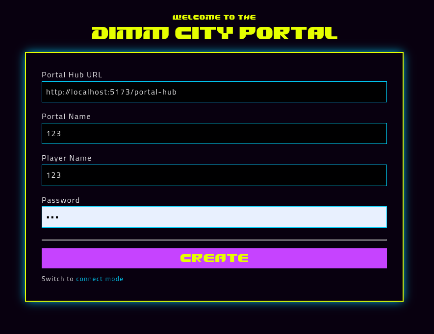

# Dimm City Portal

<!-- ALL-CONTRIBUTORS-BADGE:START - Do not remove or modify this section -->
[](#contributors-)
<!-- ALL-CONTRIBUTORS-BADGE:END -->

**Open-Source Virtual Tabletop for Self-Hosted TTRPG Groups**

A lightweight, secure, and feature-rich VTT designed for groups who want complete control over their gaming experience. No subscriptions, no cloud lock-in, no data mining—just you and your players.



**[Try Demo](https://demo.dimm.city)** • **[Documentation](./docs/)** • **[Self-Hosting Guide](./SELF_HOSTING.md)** • **[Report Bug](https://github.com/dimm-city/dimm-city-portal/issues)**

---

## ✨ Features

### 🎮 Core VTT Features
- **Real-Time Collaborative Drawing** - Shared canvas with drawing tools, shapes, and text
- **Initiative Tracker** - Combat turn management with automatic sorting and turn indicators
- **Built-In Dice Roller** - Full dice notation support (1d20, 2d6+3, etc.) with 3D animations
- **In-Game Chat** - Real-time messaging with system notifications for game events
- **Scene Persistence** - Auto-save every 5 minutes, manual save/load, export to SVG
- **Session Browser** - Discover and join public games (optional)
- **Token System** - Drag-and-drop tokens with player avatars

### 🔒 Security & Privacy
- **Password-Protected Sessions** - bcrypt hashing with complexity requirements
- **Rate Limiting** - Protection against abuse and DOS attacks
- **XSS Prevention** - DOMPurify sanitization for all user content
- **CSP Headers** - Content Security Policy enforcement
- **Input Validation** - Comprehensive server-side validation
- **No Tracking** - Zero analytics, zero telemetry, your data stays yours

### 🚀 Self-Hosting Ready
- **One-Command Deployment** - `docker-compose up -d` and you're running
- **SQLite Database** - No external database required, all data in one file
- **Automated Backups** - Built-in backup/restore with configurable retention
- **Environment Config** - Full control via .env file
- **Reverse Proxy Ready** - Works seamlessly behind nginx/Caddy
- **PWA Support** - Install to home screen on mobile devices

### 📱 Mobile-Friendly
- **Responsive Design** - Works on desktop, tablet, and phone
- **Touch Optimized** - 44px minimum touch targets (Apple HIG compliant)
- **Offline Capable** - Service worker caching for faster loads
- **Progressive Web App** - Install like a native app

---

## 🚀 Quick Start

### Option 1: Docker (Recommended)

```bash
# Clone repository
git clone https://github.com/dimm-city/dimm-city-portal.git
cd dimm-city-portal

# Start with Docker Compose
docker-compose up -d

# Open http://localhost:3000
```

**That's it!** Your VTT is now running. See [DOCKER.md](./DOCKER.md) for advanced configuration.

### Option 2: Node.js

```bash
# Clone repository
git clone https://github.com/dimm-city/dimm-city-portal.git
cd dimm-city-portal

# Install dependencies
npm install

# Build for production
npm run build

# Start server
PORT=3000 node build/index.js

# Open http://localhost:3000
```

### Option 3: Development Mode

```bash
# Install dependencies
npm install

# Start dev server with hot reload
npm run dev

# Open http://localhost:5173
```

---

## 📖 Usage

### Creating a Session

1. Enter your **name** (this will be your in-game display name)
2. Enter a **session name** (e.g., "Dragon Heist Campaign")
3. Set a **password** (8+ characters, requires letter + number)
4. Choose **game system** (D&D 5e, Pathfinder, Generic, etc.)
5. Set **max players** and privacy settings
6. Click **Create Session**
7. Share the **Session ID** and **password** with your players

### Joining a Session

1. Click **"Connect Mode"** at the top
2. Enter your **name**
3. Enter the **Session ID** (provided by your DM)
4. Enter the **password**
5. Click **Connect**

### Using the VTT

**Drawing & Maps:**
- Click drawing tools to add shapes, lines, text
- Upload battle maps via the canvas
- Pan and zoom with mouse/touch

**Initiative Tracker (DM Only):**
- Click **"Add Combatant"** to add PCs, NPCs, monsters
- Enter name, initiative roll, HP, AC
- Click **"Start Combat"** to begin tracking turns
- Use **Next/Previous** buttons to advance turns
- Edit HP by clicking on the value

**Dice Rolling:**
- Type dice notation in chat or use dice roller
- Examples: `1d20`, `2d6+3`, `d20+5`
- Results broadcast to all players
- Nat 20/Nat 1 highlighted

**Chat:**
- Type messages in the chat panel (bottom-right)
- System messages for player joins, dice rolls, turn changes
- Minimize panel to save screen space

**Saving Scenes:**
- Click **"Save Scene"** (auto-saves every 5 minutes for DM)
- **"Load Scene"** to restore a saved scene
- **"Export SVG"** to download scene as file

---

## ⚙️ Configuration

### Environment Variables

Copy `.env.example` to `.env` and customize:

```bash
# Server
PORT=3000
HOST=0.0.0.0
NODE_ENV=production

# CORS (add your domain)
ALLOWED_ORIGINS=http://localhost:3000,https://yourdomain.com

# Sessions
SESSION_TTL=86400          # 24 hours
MAX_SESSIONS=100
MAX_PLAYERS_PER_SESSION=10
ENABLE_SESSION_BROWSER=true

# Database
SQLITE_DB_PATH=./data/sessions.db

# Rate Limiting (points per duration in seconds)
RATE_LIMIT_SESSION_CREATION_POINTS=5
RATE_LIMIT_SESSION_CREATION_DURATION=3600

# See .env.example for full list
```

See [.env.example](./.env.example) for all available options.

---

## 🐳 Deployment

### Docker Compose (Production)

**1. Edit `docker-compose.yml` for your domain:**

```yaml
environment:
  - ALLOWED_ORIGINS=https://vtt.yourdomain.com
```

**2. Start the container:**

```bash
docker-compose up -d
```

**3. Setup reverse proxy (nginx example):**

```nginx
server {
    listen 443 ssl http2;
    server_name vtt.yourdomain.com;

    ssl_certificate /path/to/cert.pem;
    ssl_certificate_key /path/to/key.pem;

    location / {
        proxy_pass http://localhost:3000;
        proxy_http_version 1.1;
        proxy_set_header Upgrade $http_upgrade;
        proxy_set_header Connection 'upgrade';
        proxy_set_header Host $host;
        proxy_cache_bypass $http_upgrade;
        proxy_set_header X-Real-IP $remote_addr;
        proxy_set_header X-Forwarded-For $proxy_add_x_forwarded_for;
        proxy_set_header X-Forwarded-Proto $scheme;
    }
}
```

**4. Get SSL certificate with Let's Encrypt:**

```bash
sudo certbot --nginx -d vtt.yourdomain.com
```

See **[DOCKER.md](./DOCKER.md)** and **[SELF_HOSTING.md](./SELF_HOSTING.md)** for complete guides.

---

## 💾 Backup & Restore

### Create Backup

```bash
npm run backup
```

Creates timestamped backup in `./backups/` and cleans up old backups (7 days retention).

### Restore from Backup

```bash
npm run restore backups/backup-2024-11-19-12-30-00.db
```

Interactive restore with safety backup before replacing database.

### Automated Backups

**Cron job (daily at 2 AM):**

```bash
crontab -e
# Add:
0 2 * * * cd /path/to/dimm-city-portal && npm run backup:auto
```

See **[BACKUP.md](./BACKUP.md)** for disaster recovery and offsite backup strategies.

---

## 🏗️ Architecture

**Stack:**
- **Frontend:** SvelteKit 2.48.5 + Svelte 5 (runes mode)
- **Backend:** Node.js with Socket.IO 4.7.5
- **Database:** SQLite (better-sqlite3)
- **Drawing:** js-draw canvas library
- **Dice:** 3d-dice-box-threejs
- **Security:** bcrypt, DOMPurify, rate-limiter-flexible

**Key Design Decisions:**
- **Self-hosted first** - No cloud dependencies
- **Zero configuration** - Works out of the box
- **SQLite for simplicity** - Easy to backup, no database server needed
- **Progressive enhancement** - Works without JavaScript for core features
- **Mobile-first CSS** - Responsive from the ground up

**File Structure:**
```
dimm-city-portal/
├── src/
│   ├── lib/
│   │   ├── components/      # Svelte components
│   │   │   ├── InitiativeTracker.svelte
│   │   │   ├── ChatPanel.svelte
│   │   │   ├── Portal.svelte
│   │   │   └── editor/      # Canvas drawing tools
│   │   └── server/          # Backend
│   │       ├── PortalServer.js    # WebSocket handlers
│   │       ├── SessionStore.js    # SQLite persistence
│   │       └── RateLimiter.js     # Rate limiting
│   └── routes/              # SvelteKit routes
│       ├── +page.svelte     # Homepage
│       └── api/             # REST API endpoints
├── scripts/
│   ├── backup.js            # Backup utility
│   └── restore.js           # Restore utility
├── data/                    # SQLite database (gitignored)
├── backups/                 # Backup directory (gitignored)
└── docker-compose.yml       # Docker deployment
```

---

## 🛣️ Roadmap

### ✅ Completed (v0.9)
- ✅ Real-time collaborative drawing
- ✅ Initiative tracker with combat management
- ✅ Dice roller with 3D animations
- ✅ In-game chat with system messages
- ✅ Scene save/load with auto-save
- ✅ Session browser and discovery
- ✅ Password authentication with bcrypt
- ✅ Rate limiting and security hardening
- ✅ SQLite persistence
- ✅ Docker deployment
- ✅ Backup/restore system
- ✅ Mobile-responsive PWA

### 🚧 In Progress (v1.0 - Target: December 2024)
- 🔄 Battle maps library (10-15 free maps)
- 🔄 Token library (50-100 free tokens)
- 🔄 Demo session with quickstart
- 🔄 Comprehensive documentation
- 🔄 Video tutorials

### 🔮 Planned (v1.1+)
- Fog of War
- Measurement tools (distance, area)
- Dynamic lighting
- Layer system (map, tokens, effects)
- Audio/music integration
- Improved token management
- Character sheets (basic)
- Macro support
- Module/plugin system

See [AAA_VTT_ROADMAP.md](./AAA_VTT_ROADMAP.md) for detailed roadmap.

---

## 🤝 Contributing

We welcome contributions! Here's how to get started:

### Development Setup

```bash
# Fork and clone your fork
git clone https://github.com/YOUR_USERNAME/dimm-city-portal.git
cd dimm-city-portal

# Install dependencies
npm install

# Start dev server
npm run dev

# Open http://localhost:5173
```

### Making Changes

1. Create a branch: `git checkout -b feature/your-feature`
2. Make your changes
3. Test thoroughly
4. Commit: `git commit -m "Add: your feature description"`
5. Push: `git push origin feature/your-feature`
6. Create Pull Request on GitHub

### Code Style

- **JavaScript/Svelte:** Follow existing code style (Prettier configured)
- **Commits:** Use conventional commits (feat:, fix:, docs:, etc.)
- **Testing:** Add tests for new features
- **Documentation:** Update README and docs as needed

### What to Contribute

**Good first issues:**
- Bug fixes
- Documentation improvements
- UI/UX enhancements
- Accessibility improvements
- Mobile optimizations

**Larger features:**
- See [AAA_VTT_ROADMAP.md](./AAA_VTT_ROADMAP.md) for planned features
- Open an issue first to discuss approach
- Break into smaller PRs when possible

---

## 📝 License

<p xmlns:cc="http://creativecommons.org/ns#" xmlns:dct="http://purl.org/dc/terms/"><a property="dct:title" rel="cc:attributionURL" href="https://github.com/dimm-city/dimm-city-portal">Dimm City Portal</a> by <a rel="cc:attributionURL dct:creator" property="cc:attributionName" href="https://github.com/dimm-city/">Dimm City RPG</a> is licensed under <a href="https://creativecommons.org/licenses/by-sa/4.0/?ref=chooser-v1" target="_blank" rel="license noopener noreferrer" style="display:inline-block;">CC BY-SA 4.0</a></p>

**What this means:**
- ✅ Use commercially or personally
- ✅ Modify and adapt
- ✅ Share and redistribute
- ⚠️ Must attribute original authors
- ⚠️ Derivatives must use same license

See [LICENSE](./LICENSE) for full terms.

---

## 🙏 Acknowledgments

**Built with amazing open-source tools:**
- [SvelteKit](https://kit.svelte.dev/) - Web framework
- [Socket.IO](https://socket.io/) - Real-time communication
- [js-draw](https://github.com/personalizedrefrigerator/js-draw) - Drawing canvas
- [3D Dice Box](https://github.com/3d-dice/dice-box) - Dice roller
- [better-sqlite3](https://github.com/WiseLibs/better-sqlite3) - SQLite wrapper

**Special thanks to:**
- [2-Minute Tabletop](https://2minutetabletop.com/) - Battle map inspiration
- [game-icons.net](https://game-icons.net/) - Token icon source
- The entire TTRPG open-source community

---

## 👥 Contributors

Thanks to these wonderful people ([emoji key](https://allcontributors.org/docs/en/emoji-key)):

<!-- ALL-CONTRIBUTORS-LIST:START - Do not remove or modify this section -->
<!-- prettier-ignore-start -->
<!-- markdownlint-disable -->
<table>
  <tbody>
    <tr>
      <td align="center" valign="top" width="14.28%"><a href="https://github.com/itlackey"><br /><sub><b>IT Lackey</b></sub></a><br /><a href="https://github.com/dimm-city/dimm-city-portal/commits?author=itlackey" title="Code">💻</a> <a href="https://github.com/dimm-city/dimm-city-portal/commits?author=itlackey" title="Documentation">📖</a></td>
      <td align="center" valign="top" width="14.28%"><a href="https://github.com/Scotto1980"><br /><sub><b>Scotto1980</b></sub></a><br /><a href="#design-Scotto1980" title="Design">🎨</a></td>
    </tr>
  </tbody>
</table>

<!-- markdownlint-restore -->
<!-- prettier-ignore-end -->

<!-- ALL-CONTRIBUTORS-LIST:END -->

This project follows the [all-contributors](https://github.com/all-contributors/all-contributors) specification. Contributions of any kind welcome!

---

## 🆘 Support & Community

- **📚 Documentation:** [./docs/](./docs/)
- **🐛 Bug Reports:** [GitHub Issues](https://github.com/dimm-city/dimm-city-portal/issues)
- **💡 Feature Requests:** [GitHub Discussions](https://github.com/dimm-city/dimm-city-portal/discussions)
- **🐳 Docker Help:** [DOCKER.md](./DOCKER.md)
- **🏠 Self-Hosting:** [SELF_HOSTING.md](./SELF_HOSTING.md)
- **💾 Backups:** [BACKUP.md](./BACKUP.md)

---

## ⚡ Performance

- **First Load:** < 3 seconds on average connection
- **Bundle Size:** ~500KB gzipped (client + vendor)
- **Database:** Handles 100+ concurrent sessions on modest hardware
- **Memory:** ~100MB per instance
- **Storage:** ~1KB per session (excluding scene images)

**Tested on:**
- Raspberry Pi 4 (4GB)
- $5/month VPS (1GB RAM)
- Home server (Docker)

---

## 🔐 Security

Security is a top priority. We implement:
- Password hashing with bcrypt (10 salt rounds)
- Rate limiting on all endpoints
- XSS prevention with DOMPurify
- CSP headers
- Input validation and sanitization
- CORS configuration
- SQLite prepared statements (SQL injection prevention)

**Reporting Security Issues:**
Please email security@dimm.city (do not open public issues for security vulnerabilities).

---

<p align="center">
  <strong>Made with ❤️ by tabletop gamers, for tabletop gamers</strong><br>
  <sub>Self-host your way to better game nights</sub>
</p>

<p align="center">
  <a href="https://demo.dimm.city">Try Demo</a> •
  <a href="./DOCKER.md">Quick Start</a> •
  <a href="https://github.com/dimm-city/dimm-city-portal/issues">Report Issue</a>
</p>
